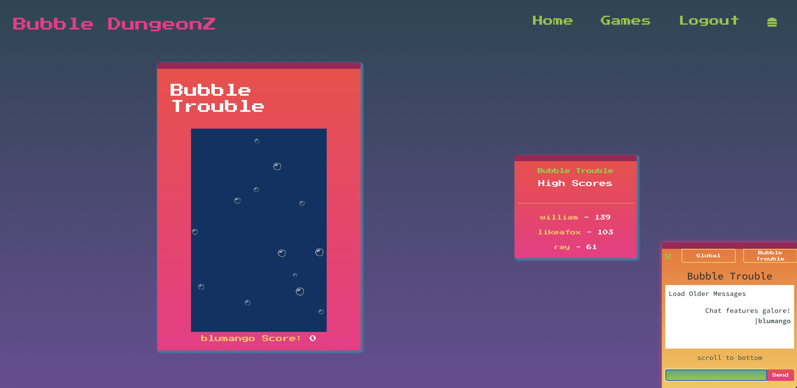

# bubbleDungeonz

A MERN-stack game-hosting website complete with user authentication, dynamically-generating chat channels, and High Score boards for each game.

## Technologies used:

1. MongoDB, Mongoose, GraphQL with Apollo server
2. Express server
3. React front end
4. Node.js
5. Socket.io
6. Canvas API

## Table of Contents

1.  [Usage](#Usage)
2.  [Installation](#Installation)
3.  [Contributing](#Contributing)
4.  [Questions](#Questions)
5.  [Tests](#Tests)
6.  [License](#License)

## Usage

    After starting the server, go to deployed website.

You can check out the deployed application [here](https://bubbledungeonz.herokuapp.com/).

## Installation

    1. Download repo
    2. Run "npm i" in the root folder.\
    3. Run "Npm run seed" to seed the database for gameplays.
    4. run "npm run develop"

## Contributing

We love your input! We want to make contributing to this project as easy and transparent as possible, whether it's:

1.  Reporting a bug

2.  Discussing the current state of the code

3.  Submitting a fix

4.  Proposing new features

## Questions

- Raymond Lewis |
  [GitHub](https://github.com/l1keafox) |
  [raymond.ed.lewis@gmail.com](mailto:raymond.ed.lewis@gmail.com) | 🐱
- Becca Roberts |
  [GitHub](https://github.com/relero90) |
  [relero90@gmail.com](mailto:relero90@gmail.com) | 🐕🐱🐱
- James Young |
  [GitHub](https://github.com/jamesyoungGHusername) |
  [jamesyoungwrites@gmail.com](mailto:jamesyoungwrites@gmail.com) | 🦉🦉
- Tate Foster |
  [GitHub](https://github.com/TateFoster) |
  [tate.j.foster@gmail.com](mailto:tate.j.foster@gmail.com) | 🐹🐹🐹🐹🐹
- Tyler Anderson |
  [GitHub](https://github.com/madrodgerflynn) |
  [rmadrodgerflynn@gmail.com](mailto:madrodgerflynn@gmail.com) | 🐧🐧🐱🐱

## License

[MIT](https://choosealicense.com/licenses/mit/)
